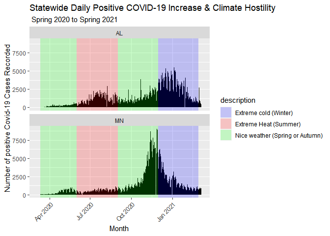

# Statistical Analysis of Positive COVID-19 case Increase in States of Varying Climate Hostility

Presentation ID: 4974

Alec White & Dr. Christopher Merkord

Biosciences Department, Minnesota State University Moorhead, 1104 7th
Avenue South, Moorhead, MN 56563 USA

Presented at the MSUM 23rd Online Student Academic Conference

Submit a survey for this presentation:
<https://mnstate.co1.qualtrics.com/jfe/form/SV_eFMAwF72JZIoeSq>

## Abstract

The data being analyzed in this experiment will come from the Minnesota
and Alabama COVID-19 (SARS-CoV-2) datasets at The COVID Tracking
Project. During this exploratory data analysis, I will be comparing the
daily positive case increase in the States of Minnesota & Alabama due to
their differences in climate hostility throughout the seasons of the
year and similar population size. During this analysis, recorded data
over the course of a roughly 13-month period from 2/2020 to 3/2021 will
be analyzed in respect to the local seasonal climate since data on
COVID-19 began getting recorded daily. A possible result that may be
concluded from this statistical analysis is that there will be a
difference in the percentage of positive case increases during times of
the year where the climate in these states is considered hostile.

## Introduction

For the past 12 months COVID-19 has been a prominent scientific topic in
both the United States and the world due to its relatively high
mortality rate and ability to spread efficiently and unpredictably. The
effects of this viral agent have been the cause of many hospitalizations
and deaths in a wide range of age groups and heath statuses.

There has been a large number of studies related to COVID-19 have since
been released due to the large effect it has had on the world
population’s daily lives. With how widespread COVID-19 has become,
many location related questions can be asked, such as does the
percentage of positive case increases have a correlation with a
location’s climate and the local population’s response to the
hostilities associated with that climate during different portions of
the year? This data may be used to help predict increases in positive
case rates while certain climate changes are approaching within the
different states and to allow medical services to be more adequately
prepared for a heavier flow of positive COVID-19 cases.

To show how a population’s response to local climate hostility may be
affecting the COVID-19 positive case increase I will be taking daily
data from two populations with different climates over the course of one
year.

## Methods

We are displaying our data and our presentation by using R studio and R,
the current versions that we are using is R version 4.0.3 (R Core Team
2020), and for R studio we are using R.Studio 1.4.1103 (RStudio Team
2021)

### Data Acquisition

For this project, all data was analyzed and manipulated using RStudio
(RStudio Team 2020). The Covid-19 data acquired between the states of
Alabama and Minnesota was gathered from The COVID Tracking Project (The
Atlantic Monthly Group, 2021). On their website, there is data daily
data pertaining to the Covid-19 pandemic for each state within the
United States. To acquire the data, first I opened a new R script in R
studio. I used R version 4.0.3 (R Core Team, 2020) and RStudio version
1.3.1093 (RStudio Team 2020).Then I loaded the tidyverse package
(Wickham et al. 2019) and the lubridate package (Garrett Grolemund and
Hadley Wickham 2011). After doing so I then read in the data for Alabama
and Minnesota using the read\_csv() function, as shown below (Hadley
Wickham and Jim Hester 2020).

### Data Preparation

After acquiring the data for the two states being analyzed I combined
the data for Alabama and Minnesota into one table by using the function
bind\_rows() (Hadley Wickham et al. 2020). following this I isolated the
target data variables within a the plot function &&&. After this I

## Results

The results are based off of daily Covid-19 positive case increase
between the states of Alabama and Minnesota with respect to
seasons(Summer, Winter, ect.) and the climates associated with them

There is a steady increase in the number positive case increase recorded
during seasons of extreme temperatures in both Minnesota and Alabama.
(Figure 1.)

<!-- -->

Figure 1. Daily reported Covid-19 Positive increase values with Weather
hostility patterns in regards to official season start dates in
Minnesota and Alabama.

There is a slower rate at which Minnesota COVID-19 cases during extreme
heat seasons, Alabama also appears to have a larger amount of
individuals with positive confirmed cases during the extreme cold
seasons.

<!-- -->

Figure 2. Line graphs showing the Positivity rate per 1,000 of each
states population during official seasons.

## Discussion

The initial analysis of the daily positive increase between the states
of Minnesota and Alabama shows Alabama having a steady increase in
positive

## References

  - The Atlantic Monthly Group. The COVID Tracking Project, 2021.
    <https://covidtracking.com/about-data>.

  - Hadley Wickham and Jim Hester (2020). readr: Read Rectangular Text
    Data. R package version 1.4.0.
    <https://CRAN.R-project.org/package=readr>

  - Garrett Grolemund, Hadley Wickham (2011). Dates and Times Made Easy
    with lubridate. Journal of Statistical Software, 40(3), 1-25. URL
    <https://www.jstatsoft.org/v40/i03/>.

  - Wickham et al., (2019). Welcome to the tidyverse. Journal of Open
    Source Software, 4(43), 1686, <https://doi.org/10.21105/joss.01686>

  - R Core Team (2020). R: A language and environment for statistical
    computing. R Foundation for Statistical Computing, Vienna, Austria.
    URL <https://www.R-project.org/>.

  - RStudio Team (2020). RStudio: Integrated Development Environment for
    R. RStudio, PBC, Boston, MA URL <http://www.rstudio.com/>.

  - Hadley Wickham, Romain François, Lionel Henry and Kirill Müller
    (2020). dplyr: A Grammar of Data Manipulation. R package version
    1.0.2. <https://CRAN.R-project.org/package=dplyr>

  - H. Wickham. ggplot2: Elegant Graphics for Data Analysis.
    Springer-Verlag New York, 2016.
